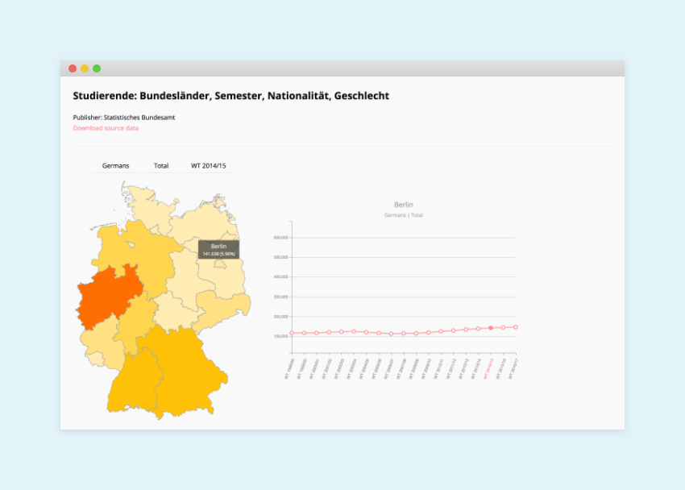

[](LICENSE.md)
[](https://github.com/eliashaeussler/student-growth/releases/)
[](https://travis-ci.org/eliashaeussler/student-growth)
[](https://github.styleci.io/repos/132896060)


# Student growth

A JavaScript-based project demonstrating the student growth in Germany in the past 20 years. It uses data from the
[Federal Statistical Office of Germany](https://www.destatis.de/EN/Homepage.html).

The project is based on the [D3 library](https://github.com/d3/d3) and developed with [Gulp](https://github.com/gulpjs/gulp).





## Requirements

* `yarn` or `npm` to install the required packages
* [Python 3.6](https://www.python.org/) in case you want to download the latest data


## Installation

For installation, clone the repository first.

```bash
git clone https://github.com/eliashaeussler/student-growth.git
cd student-growth
```

After cloning install the Node dependencies:

```bash
yarn install
```

You can also use `npm install` in case you haven't installed `yarn`.


## Build the site

In order to access the website which shows the visualization, you need to build the necessary project files:

```bash
yarn run build
```

You can alternatively use `npm run-script build` or `gulp --production && gulp server`.

This compiles all necessary files and places them inside a `dist` folder. Files from this folder will be used as source
for a web server which automatically starts running when you run one of the above commands.

If your Browser does not open by it's own, open it manually and navigate to the following page:

<http://localhost:8000>

If port `8000` is already in use, BrowserSync tries to use the next available port. You can see the active port in your
command line after running one of the above commands.


### Development mode

```bash
yarn run start
```

(alternatively: `npm start` or simply `gulp`)

The Development mode allows you to see changes on project files immediately in your browser since BrowserSync is watching
for changes.


### Other tasks

| `npm` script | Gulp task | Description |
| ---------- | --------- | ----------- |
| `sources` | `default --production` | Build only the source files and does not start the server |
| `serve` | `serve` | Run the server without creating any source files |
| `watch` | `server watch` | Run the server without creating source files and watch for changes |
| `test` | – | Test the project (does not start the server) |

All `npm` scripts need to be executed using `yarn run <command>` or `npm run-script <command>`.
When running Gulp tasks, execute them using `gulp <command>`.


## Download the latest data

The necessary data has already been downloaded and is included in this repository. You can always download the latest data
using the available download script (note that it's required to have `python3` installed for this):

```bash
python3 bin/download.py
```

After a few seconds you will see something like this:

```bash
Downloading: Studierende: Bundesländer, Semester, Nationalität, Geschlecht
Download successful: src/data/data.csv
```

### Source configuration

The file `data/source.json` contains important information which are being used to parse the remote source file correctly.

| Key | Description | Configuration |
| --- | --- | --- |
| `url` | File which contains information about the source files and their file formats | Valid URL with protocol as string |
| `keys` | Position of keys (headlines) inside the source file (X and Y) | Object with keys `x` and `y` which contain arrays with numbers |
| `data_rows` | Position of first and last data row | Object with keys `first` and `last` as numbers. `last` can be a row number (e.g. `293`) or the difference from the last available row (e.g. `-4`, more flexible)

### Installing certificates on macOS

If you are working with macOS, you might run into trouble when running the python script. You might get an output like this:

```
<urlopen error [SSL: CERTIFICATE_VERIFY_FAILED] certificate verify failed (_ssl.c:749)>
```

In this case, you need to install additional certificates. The installation script is installed inside your Python application
folder, e.g. `Applications/Python 3.6/Install Certificates.command`. It installs `certifi` on your system which is needed
to handle secure remote connections.


## Resources

* [dataBundesLander.json](https://gist.github.com/oscar6echo/4423770#file-databundeslander-json) by [oscar6echo](https://gist.github.com/oscar6echo)
* [21311-0005.csv](https://www-genesis.destatis.de/genesis/online?sequenz=tabelleDownload&selectionname=21311-0005&regionalschluessel=&format=csv) (modified) by the [Federal Statistical Office of Germany](https://www.destatis.de/EN/Homepage.html) 
* [SpinKit](https://github.com/tobiasahlin/SpinKit) by [Tobias Ahlin](https://github.com/tobiasahlin) 


## License

[MIT License](LICENSE.md)
